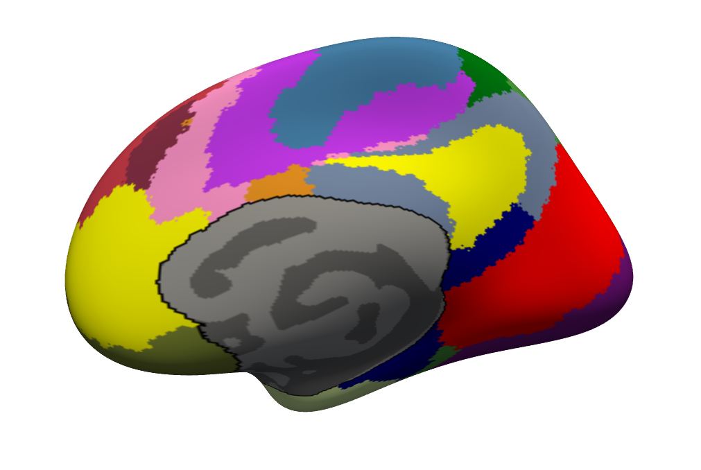

# Guide for creating gcs files for your parcellation

### Background

Gcs files are used for generating individual surface parcellation. 

For details, please refer to [**The Automatic Surface Labeling Process; GC Atlases**](https://surfer.nmr.mgh.harvard.edu/fswiki/SurfaceLabelAtlas)

If you have a group level parcellation in Freesurfer fsaverage5/fsaverage6/fsaverage space, you can refer to this guide to create your own gcs files for your parcellation. 

In this guide, we take fsaverage as example. We also recommend you to use a high resolution. 

----
# Usage

### 1: Preparations

**Training set**

You need at least 15 subjects. For example, use [**Genomics Superstruct Project (GSP) Open Data Release**](https://www.neuroinfo.org/gsp/) for training. 

The training procedure is dependent on the structure of the subject folder. Each subject should have a folder under `$SUBJECTS_DIR` and the folder name is the subject name. Each subject folder should include `label` and `surf` folder. 

You should copy or make symbolic links for these files:

```
$SUBJECTS_DIR/<subject>/surf/<?h>.smoothwm
$SUBJECTS_DIR/<subject>/surf/<?h>.sphere.reg
$SUBJECTS_DIR/<subject>/label/<?h>.cortex.label
```

If you want to visualize the surface, you should also include:

```
$SUBJECTS_DIR/<subject>/surf/<?h>.<inflated/sphere/white>
```

To change `$SUBJECTS_DIR` to your output path, for csh:

```
setenv SUBJECTS_DIR <outdir>
source $FREESURFER_HOME/SetUpFreeSurfer.csh
```

For bash:

```
export SUBJECTS_DIR=<outdir>
source $FREESURFER_HOME/SetUpFreeSurfer.sh
```


**Annot files**

Please compare your parcellation with `?h.cortex.label` of fsaverage. If the medial wall is different, you should consider filling the cortex region (defined by `?h.cortex.label`) and remove the medial wall region before you move on. 

For example, assume your original parcellation in `fsaverage` space looks like: 


This is the right hemisphere of `fsaverage` space. The black line is the boundary between cortex and medial wall, defined by `rh.cortex.lable`. Notice that the medial wall of the parcellation and the medial wall defined by `rh.cortex.lable` are not exactly the same.

After matching the medial wall defined by `rh.cortex.lable`, it should look like:


This step is not required but we recommend you to do it. 

If the medial wall is labeled as R=0, G=0, B=0, then the vertices inside the medial wall will be assigned to other parcels using `mris_ca_label` after training. Otherwise, the medial wall will be treated as a parcel and the medial wall might be in a different shape using `mris_ca_label` after training.

We suggest you to label the medial wall as R=1, G=1, B=1 and name it as "Unknown" in the color table in [**step 3: Training**](#3-training).

### 2: Project group level parcellation to individual surface space

Use `mri_surf2surf` to project your group level parcellation to individual surface space for each training subject. 

For details, please refer to [**mri_surf2surf**](https://surfer.nmr.mgh.harvard.edu/fswiki/mri_surf2surf)

```
mri_surf2surf --cortex --srcsubject fsaverage --trgsubject <subject> \
	--hemi <?h> --sval-annot <your_group_annot_file> --tval <?h>.<annot_name>.annot
```

Option `--cortex` uses `?h.cortex.label` as a smoothing mask. This option is alternative.

This command creates annot files for both hemisphere under `$SUBJECTS_DIR/<subject>/label`. You can visualize the result using the following command:

```
freeview -f $SUBJECTS_DIR/<subject>/surf/<?h>.<inflated/sphere/white>:annot=$SUBJECTS_DIR/<subject>/label/<?h>.<annot_name>.annot
```

### 3: Training

Use `mris_ca_train` to create gcs files based on your training set.

For details, please refer to [**mris_ca_train**](https://surfer.nmr.mgh.harvard.edu/fswiki/mris_ca_train)

```
mris_ca_train -t <colortable> ?h sphere.reg <annot_name> \
	<subject_1> <subject_2> ... <subject_N>\
	<output_dir>/<?h>.<gcs_name>.gcs

```

Option `-t <colortable>` specify the color table of your parcellaion. The parcel name in the annot file will be overwritten by the given color table. The format of the color table file is the same with Freesurfer lookup table:

```
#No.	Label Name	R   G   B   A
```

The color in this text file should match the color table in your annot files.

If your parcels names are different between left and right hemisphere, you should split the color table into two. The color table of each hemisphere should not contain parcels from the other hemisphere. 

Your gcs files are generated after this step. 

### 4: Use gcs file to generate individual surface parcellation

To check the performance of your gcs files, use `mris_ca_label` to generate individual surface parcellation using your gcs files.

```
mris_ca_label -l $SUBJECTS_DIR/<subject>/label/<?h>.cortex.label \
	-aseg $SUBJECTS_DIR/<subject>/mri/aseg.mgz -seed 1234 <subject> <?h> \
	$SUBJECTS_DIR/<subject>/surf/<?h>.sphere.reg <gcs_file> <output_annot_file>
```

Where option `-aseg` use volume to correct midline. This option is not compulsory. Option `-seed` specifies the random seed. 

You can visualize the result using the following command:

```
freeview -f $SUBJECTS_DIR/<subject>/surf/<?h>.<inflated/sphere/white>:annot=<output_annot_file>
```

This output annot file should be similar with the annot file generated by `mri_surf2surf` in [**step 2: Project group level parcellation to individual surface space**](#2-project-group-level-parcellation-to-individual-surface-space).

----
# Code

For example, to generates the gcs files for Schaefer2018 parcellation (400 parcels, 17 networks), run the following command:

```
$CBIG_CODE_DIR/developers/ahpxue/projects/create_gcs_files/examples/gcs_example.csh <output_dir>
```

This command generates the gcs files for Schaefer2018 parcellation (400 parcels, 17 networks) and the results are stored under `<output_dir>/gcs`. 

If you want to generate gcs files for your own parcellation, please refer to `/examples/train_gcs.csh` to create your own gcs files.

